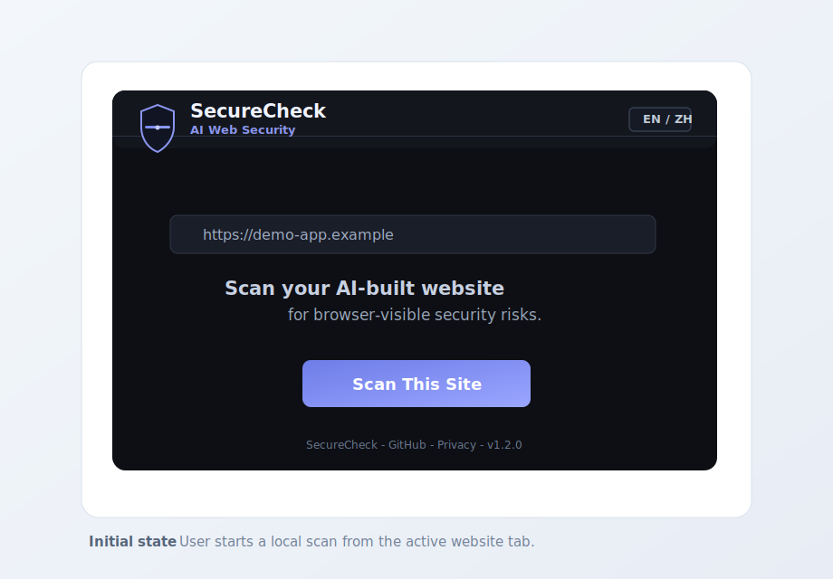
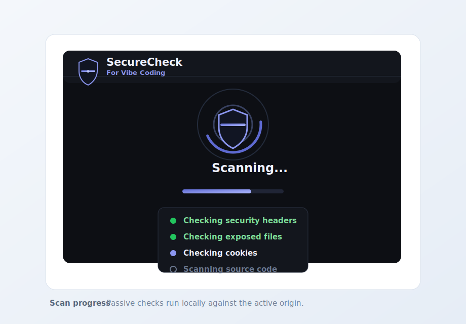
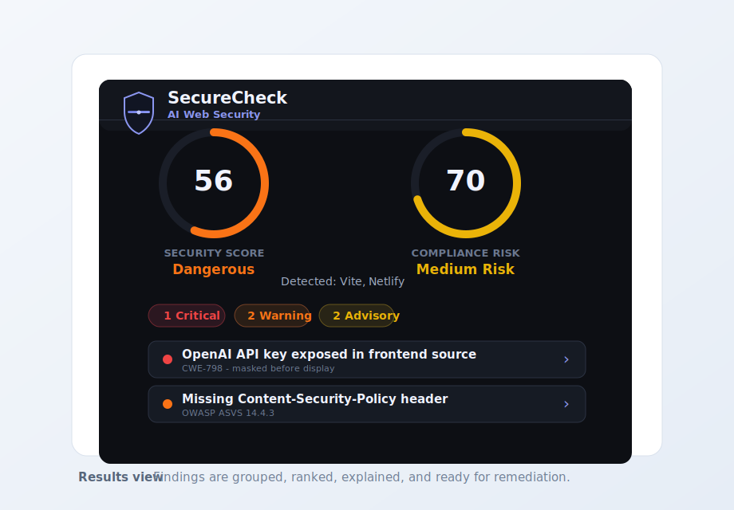
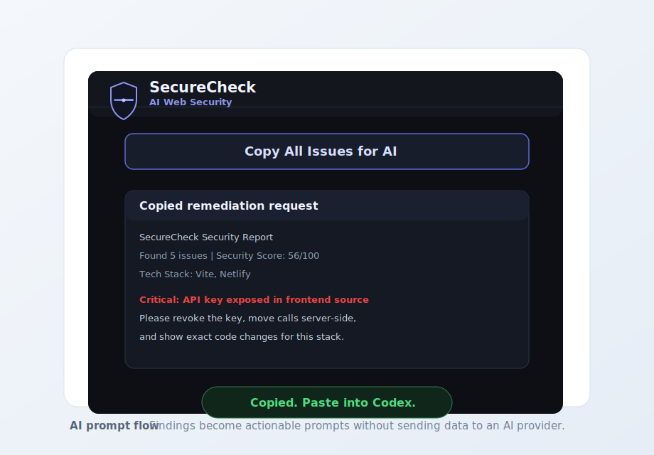

# SecureCheck AI Web Scanner

[](https://github.com/Eric4045/securecheck-ai-web-scanner/actions/workflows/ci.yml)
[](LICENSE)
[](manifest.json)

SecureCheck AI Web Scanner is a free, open-source Chrome extension for scanning AI-built websites for browser-visible security risks.

It scans the currently open live site, explains each finding in plain language, and generates copy-ready remediation prompts that builders can paste into Codex, ChatGPT, Claude, Cursor, or another AI coding assistant.

## Demo

The screenshots below use fictional `.example` data and do not contain real scan output, credentials, or user information.

| Start a scan | Scan progress |
| --- | --- |
|  |  |

| Review findings | Copy AI fix prompt |
| --- | --- |
|  |  |

Example report: [docs/example-report.md](docs/example-report.md)

Release notes: [docs/release-notes/v1.2.0.md](docs/release-notes/v1.2.0.md)

## Why This Exists

AI coding tools make it possible for founders, designers, students, and solo builders to ship websites quickly. The weak spot is that many AI-built sites reach production with preventable frontend and deployment-security mistakes.

SecureCheck gives those builders a practical first-pass security review before they ship:

- Detect common browser-visible security risks.
- Explain why each finding matters.
- Generate targeted AI fix prompts instead of vague advice.
- Keep the user in control of the actual code change.

SecureCheck does not replace a professional security audit. It focuses on passive checks that can be performed from the browser without backend credentials, form submission, fuzzing, brute force, or state-changing requests.

Findings should be treated as browser-visible signals, not proof that the full application is vulnerable. Some mature sites may intentionally mitigate a flagged frontend pattern with backend controls, layered defenses, or deployment architecture that a browser extension cannot verify.

## Core Features

- Live-site scan from the active browser tab.
- Passive checks for HTTP security headers, exposed files, cookie flags, and DOM/source patterns.
- Same-origin JavaScript bundle scanning for frontend secret and unsafe DOM patterns.
- Findings ranked as P0 Critical, P1 Warning, or P2 Advisory.
- One-click AI fix prompt for each finding.
- Copy-all report for sending the complete remediation request to an AI coding assistant.
- English and Traditional Chinese UI.
- Free and open source, with no scan limit, paywall, license gate, ads, or analytics.
- Local-first privacy model with memory-only scan results.

## Privacy And Safety Model

SecureCheck is designed to be privacy-preserving:

- Scan results are kept in memory only during the extension session.
- The extension does not run a backend service.
- The extension does not use analytics, ads, tracking pixels, or telemetry.
- Scan data is not sold, shared, or transferred to third parties.
- Cookie checks use cookie names and security attributes only. Cookie values are not displayed, stored, or transmitted.
- Detected secrets are masked before they are shown in the UI.
- Network requests are sent only to the website being scanned.
- Site permissions are requested at scan time and removed after the scan finishes.
- The scanner is passive and does not modify the target site.

Privacy policy: <https://eric4045.github.io/securecheck-privacy/>

Chrome Web Store submission notes are in [CHROME_WEB_STORE_SUBMISSION.md](CHROME_WEB_STORE_SUBMISSION.md).

## What It Scans

### HTTP Security Headers

- HTTPS enforcement
- HSTS
- Content-Security-Policy
- X-Frame-Options or `frame-ancestors`
- X-Content-Type-Options
- Referrer-Policy
- Permissions-Policy
- CORS wildcard configuration
- Server and X-Powered-By exposure
- Cache-Control
- Cross-Origin-Resource-Policy

### Exposed Files And Endpoints

- `.env`, `.env.local`, `.env.production`
- `.git/config`, `.git/HEAD`
- `backup.sql`, `db.sql`, `database.sql`
- `/admin`, `/dashboard`
- `/api-docs`, `/swagger`, `/swagger-ui.html`
- `/graphql`
- `.DS_Store`
- `phpinfo.php`
- Sensitive path hints in `robots.txt`
- Rate-limit header guidance

### Cookies

- Session cookies missing `HttpOnly`
- Cookies missing `Secure`
- Session cookies missing `SameSite`
- `SameSite=None` cookies without `Secure`
- Tracking cookies that may need review

### DOM And Frontend Source

- OpenAI, Anthropic, Google, AWS, Stripe, GitHub, Firebase, SendGrid, Twilio, Supabase service role, JWT, private key, and other secret patterns
- Mixed content on HTTPS pages
- Direct DOM insertion patterns such as `innerHTML`, `outerHTML`, `document.write`, and `insertAdjacentHTML`
- Console statements, including likely sensitive logs
- External scripts without Subresource Integrity
- Auth tokens stored in `localStorage`
- `eval()` usage

## Project Structure

```text
securecheck-ai-web-scanner/
  manifest.json
  background.js
  scanner/
    headerScanner.js
    endpointScanner.js
    cookieScanner.js
    domScanner.js
  popup/
    popup.html
    popup.css
    popup.js
  _locales/
    en/messages.json
    zh_TW/messages.json
  icons/
  fonts/
  tests/
```

## Local Development

1. Open Chrome or a Chromium-based browser.
2. Go to `chrome://extensions`.
3. Enable Developer mode.
4. Click Load unpacked.
5. Select this project folder.
6. Open a live website and click the SecureCheck extension icon.

## Checks

```bash
npm run check
npm test
```

## Open Source Fit

SecureCheck is built for the AI coding ecosystem. It helps people who create websites with AI tools find preventable security mistakes and turn those findings into clear instructions for coding agents.

Good contributions include scanner rules, false-positive fixes, vulnerable fixtures, signal-based remediation prompts for frontend frameworks and hosting platforms, extension-permission hardening, documentation, and bilingual copy improvements.

For Codex for Open Source reviewers, see [CODEX_OSS_APPLICATION.md](CODEX_OSS_APPLICATION.md).

## Limitations

SecureCheck can only detect risks visible from the browser. It cannot prove that backend authorization, business logic, database access control, server-side validation, dependency security, or production infrastructure are correct.

SecureCheck is optimized for AI-built and early-stage websites where builders may not yet know which frontend and deployment-security signals to review. It is not meant to judge mature professional sites as definitively insecure when they may have compensating controls that are not visible to the browser.

Use SecureCheck as an early safety pass, not as a complete penetration test.

## License

SecureCheck is released under the MIT License.
